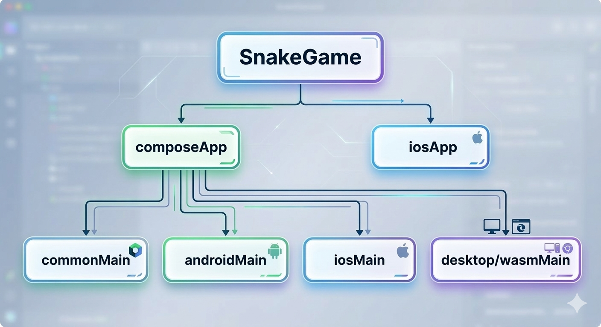

# Pixel Snake

## Demo


## Android ScreenShots
|  |  |  |
|-----------------------------------------------|-----------------------------------------------|-----------------------------------------------|

## Features
- **Cross-Platform**: Play on Android, iOS, Desktop, and Web (Wasm) with a single codebase.
- **Classic Gameplay**: Experience the nostalgic snake game with a modern "pixel" aesthetic.
- **Responsive Design**: UI adapts seamlessly to different screen sizes using Compose Multiplatform.
- **High Performance**: Smooth 60fps gameplay powered by Kotlin Coroutines.

## Project Structure
The project follows a standard Kotlin Multiplatform (KMP) structure:

```text
SnakeGame (Kotlin Multiplatform – Pixel Snake)
├─ 🎯 composeApp (core game + Compose UI)
│  ├─ src/commonMain/kotlin     ← Snake logic, grid, direction, score, game loop
│  ├─ src/androidMain           ← Android entry point
│  ├─ src/iosMain               ← iOS entry point
│  └─ src/desktopMain / wasmJsMain
├─ 📱 iosApp                    ← iOS Xcode project
├─ 🖼️ media                     ← Game screenshots / pixel assets
├─ ⚙️ gradle / gradlew files    ← Build system
├─ 📄 build.gradle.kts
├─ 📄 settings.gradle.kts
└─ 📄 README.md
```




- **`composeApp/src/commonMain`**: The heart of the project. Contains the core snake logic, game engine, and all Compose UI components.
- **`composeApp/src/androidMain`**: Android entry point and specific configurations.
- **`composeApp/src/iosMain`**: iOS-specific bridging code.
- **`composeApp/src/desktopMain`**: Desktop (JVM) entry point and window management.
- **`composeApp/src/wasmJsMain`**: Web (WebAssembly) entry point.
- **`iosApp`**: A native Xcode project that wraps the shared Compose logic for iOS.

## Technologies Used
- **[Kotlin Multiplatform (KMP)](https://kotlinlang.org/docs/multiplatform.html)**: Share code across Android, iOS, Desktop, and Web (Wasm).
- **[Compose Multiplatform](https://www.jetbrains.com/lp/compose-multiplatform/)**: Declarative UI framework for sharing UI code between platforms.
- **[Jetpack Compose](https://developer.android.com/jetpack/compose)**: Modern toolkit for building native Android UI.
- **[Kotlin Coroutines](https://kotlinlang.org/docs/coroutines-overview.html)**: For asynchronous programming and the game loop.
- **Gradle Kotlin DSL**: Modern build configuration.

## License
This project is licensed under the MIT License - see the [LICENSE](LICENSE) file for details.
